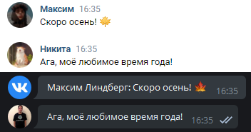
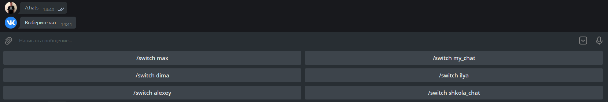

# 

    <h3>Держи все, что нужно в лучшем мессенджере ⭐</h6>
     
    <h5>Built with ❤︎, by <a href="https://t.me/l4rem">@l4rem</a></h5>

 
Поддерживаемый, написанный для людей бот, для переноса сообщений из вк в тг и наоборот.
 
 

    
    

## Функционал
- Пересылка сообщений из вк в телеграм и наоборот
  
    
- Переслыка сообщений из ВК с ответом
    
    
- Смена чата
  
    

___

🔧 Настройка:
1. Создать бота в телеграмме через **@BotFather**
2. Открыть **data.json**, и в поле **tg_token"** написать токен который вам дал @BotFather
3. Получите vk token с правами для сообщений, и укажите его в **"vk_token"**
   
✉ Настройка чатов:
1. Для того чтобы добавить лс с другом, в chats.json добавьте новый элемент с любым названием, и дальше передайте id друга. **Пример:**{...,"nikita":"npmcursed",...}
2. Чтобы добавить какую-то беседу, в **chats.json** добавьте новый элемент с окончанием **_chat**, и хранить в себе id чата, **Пример**: vk.com/im?peers=663381246&sel=c242   Id этой беседы - 242. Пример записи: **{...,"my_chat":"242",...}**
___

## 🚀 Запуск
1. **pip install -r requirements.txt**
2. **python main.py**
3. **В созданном боте в тг, пропишите /start**
